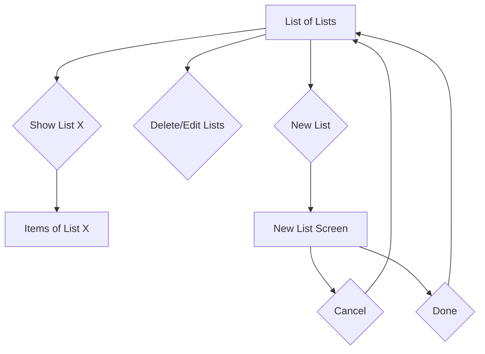

# Essentials

(`iOS`, `iPadOS`)

A simple app where user can make a lists

- UIKit
- CoreData
- Lists can be deleted/edited/rearranged

### User flow diagram of the app

```mermaid
flowchart TD
    A[List of Lists] --> B{Show List X}
    B --> H[Items of List X]
    A --> C{Delete/Edit Lists}
    A --> D{New List}
    D --> E[New List Screen]
    E --> F{Cancel}
    E --> G{Done}
    F --> A
    G --> A
```
