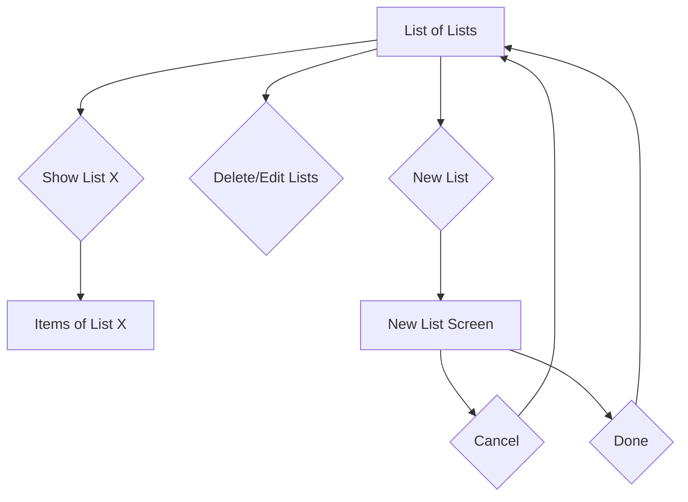

# Essentials
(for iOS and iPadOS)

- UIKit
- CoreData
- TableView
- A simple app where user can make a list of anything
- Lists can be delete, edited and rearranged
- Swipe to delete enabled UITableView cells

### User flow diagram of the app

